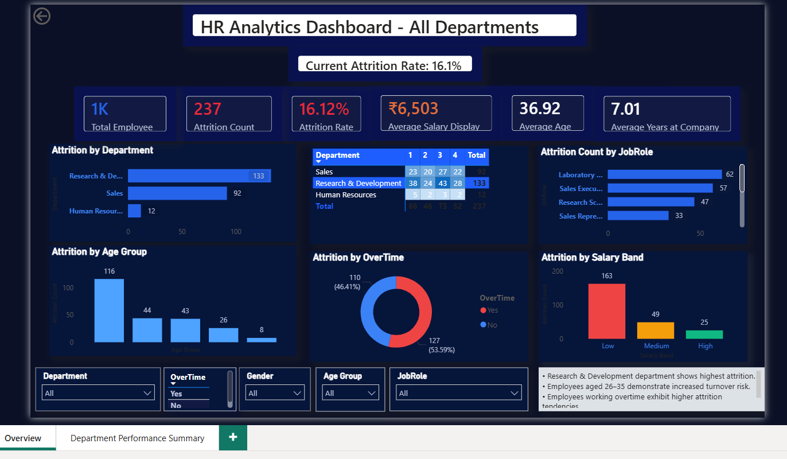
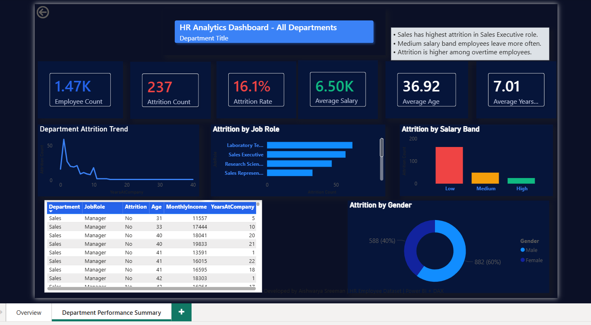

# HR-Analytics-Dashboard-Power-BI
## Project Overview
Developed an interactive HR Analytics Dashboard using Power BI to analyze employee attrition and workforce trends.

## Features
- KPI cards for employee metrics
- Attrition analysis by department
- Salary band analysis
- Job role analysis
- Employee demographic analysis
- Interactive slicers and filters
- Business insight section

## Tools & Technologies
- Power BI
- Power Query
- DAX
- Data Modeling

## Dashboard Pages

### Overview Page
Provides overall employee and attrition insights.

### Department Performance Summary
Provides department-wise analysis and workforce trends.

## Key Insights
- Research & Development department showed highest attrition.
- Employees aged 26–35 demonstrated higher turnover risk.
- Employees working overtime showed higher attrition rates.
- Lower salary bands showed increased attrition patterns.

## Screenshots

### Overview Dashboard

### Department Performance Summary

## Developed By
Aishwarya Sreeman
